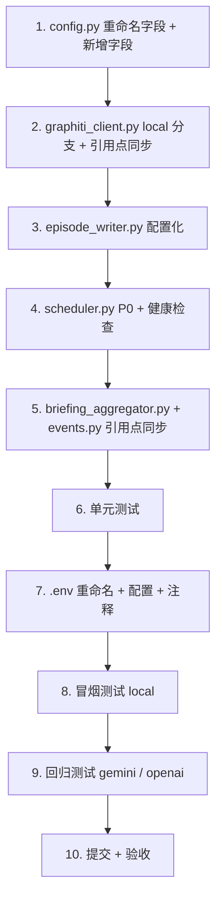

# Graphiti LLM Provider 扩展 + 并发配置化 — 实施计划

- **日期**: 2026-08-26
- **版本**: v1.1（加入配置命名统一）
- **状态**: 待实施（Boss 确认后点火）
- **前置**: 两份调研已完成（`graphiti-best-practices-gap-analysis.md`、`gemma4-gemini-replacement-feasibility.md`）

---

## 1. 背景与目标

### 背景
- **Gemini API 欠费**：免费配额频繁 429/503，需摆脱对单一 provider 的依赖
- **本地已有 Gemma 4 12B**：`llama-server` 自 8/18 运行，端口 8080，OpenAI 兼容
- **Graphiti 基础设施缺口**：索引未构建（P0）、双 Neo4j 驱动（P0）、并发/熔断参数硬编码（P1/P2）
- **配置命名违和**：`BAILIAN_API_KEY`（provider 语义）+ `OPENAI_BASE_URL`（协议语义）混用，切换 provider 时违和

### 目标
1. 保留 Gemini 支线 + 新增 local 模型支持（三 provider：gemini / openai / local）
2. 429 退避逻辑保留（对 local 无影响，自然跳过）
3. 并发参数 + 熔断参数全部配置化（.env），带注释说明推荐值
4. 补齐 P0 基础设施：索引构建 + 共享 Neo4j driver
5. 新增 local 服务健康检查
6. **配置命名统一**：`BAILIAN_API_KEY` → `OPENAI_API_KEY`，与 `OPENAI_BASE_URL` / `LLM_MODEL` / `EMBEDDING_MODEL` 语义统一（都是 OpenAI 兼容端点配置）

### 非目标（二期）
- G4 令牌桶限流（Gemini 主动控速）
- G5 微批 bulk（add_episode_bulk 降本）
- G6 同步 Neo4j 异步化（async driver / UNWIND 批量）
- G7 edge_types 归一缓存
- G8 去重缓存职责划分

---

## 2. 改动范围总览

| # | 文件 | 改动 | 工作量 |
|---|------|------|--------|
| 1 | `.env` | 重命名 `BAILIAN_API_KEY` → `OPENAI_API_KEY` + 新增配置 + 注释 | ~25 行 |
| 2 | `src/core/config.py` | 字段 `bailian_api_key` → `openai_api_key` + 新增 5 个字段 | ~35 行 |
| 3 | `src/core/graphiti_client.py` | 新增 `local` provider 分支 + 同步引用点 | ~25 行 |
| 4 | `src/graphiti/episode_writer.py` | 信号量 + 熔断参数从 settings 读取 | ~15 行 |
| 5 | `src/ingestion/scheduler.py` | 共享 driver + 索引构建 + 健康检查 | ~25 行 |
| 6 | `src/ingestion/briefing_aggregator.py` | 引用点同步 | ~3 行 |
| 7 | `src/api/routers/events.py` | 引用点同步 | ~3 行 |
| 8 | 单元测试 | 新增/更新测试 | ~40 行 |

**总改动量: ~170 行（代码 + 配置 + 测试）**

---

## 3. 分项实施计划

### 3.1 `.env` 重命名 + 新增配置（带注释）

```ini
# ============================================================
# Graphiti LLM Provider
# ============================================================
# 可选值: gemini | openai | local
#   - gemini: 原生 Gemini API（免费但不稳定）
#   - openai: OpenAI 兼容接口（百炼 DashScope）
#   - local: 本地 llama-server（零成本，吞吐受限）
GRAPHITI_LLM_PROVIDER=gemini

# ============================================================
# OpenAI 兼容接口配置（百炼 / 本地通用）
# ============================================================
# 当 GRAPHITI_LLM_PROVIDER=openai 或 local 时，使用以下配置
# - 百炼: OPENAI_BASE_URL=https://dashscope.aliyuncs.com/compatible-mode/v1
# - 本地: OPENAI_BASE_URL=http://127.0.0.1:8080/v1
OPENAI_API_KEY=***
OPENAI_BASE_URL=https://dashscope.aliyuncs.com/compatible-mode/v1
LLM_MODEL=qwen3.7-plus
EMBEDDING_MODEL=text-embedding-v4

# ============================================================
# Gemini API 配置
# ============================================================
# 当 GRAPHITI_LLM_PROVIDER=gemini 时使用
GEMINI_API_KEY=***
GEMINI_MODEL=gemini-3.5-flash-lite

# ============================================================
# Graphiti 并发控制
# ============================================================
# EPISODE_SEMAPHORE: 项目层 episode 级并发（_LLM_SEMAPHORE，控制同时处理的 episode 数）
#   - Gemini API 推荐: 3（避免 429，默认）
#   - 百炼 API 推荐: 3-5（按配额调整）
#   - 本地模型推荐: 1（llama-server --parallel 1 串行）
EPISODE_SEMAPHORE=3

# SEMAPHORE_LIMIT: graphiti-core 内部并发（单 episode 内部的多步 LLM 调用）
#   - Gemini 免费档推荐: 1-3（避免 429）
#   - Gemini 付费档推荐: 5-8
#   - 百炼 API 推荐: 5-10
#   - 本地模型推荐: 1-5（取决于 llama-server --parallel N）
#   - 默认值: 20（graphiti-core 库默认，未显式设置时生效）
SEMAPHORE_LIMIT=3

# ============================================================
# 429 熔断参数
# ============================================================
# 连续 N 次 429 后触发熔断，冷却整个写入队列
#   - Gemini 推荐: 3（默认）
#   - 本地模型推荐: 无需调整（本地不触发 429）
CIRCUIT_MAX_CONSECUTIVE_429=3

# 熔断冷却时间（秒）
#   - Gemini 推荐: 60（默认）
#   - 本地模型推荐: 无需调整
CIRCUIT_COOLDOWN_SEC=60

# 429 退避下限（秒）：尊重 API retryDelay 但不得低于此值
#   - Gemini 推荐: 37（官方 retryDelay 下限）
#   - 本地模型推荐: 无需调整
MIN_429_BACKOFF_SEC=37
```

### 3.2 `src/core/config.py` 重命名字段 + 新增字段

**重命名**：`bailian_api_key` → `openai_api_key`

```python
# === OpenAI 兼容接口（百炼 / 本地通用） ===
openai_api_key: str = Field(
    ...,
    description="OpenAI 兼容接口的 API Key（百炼 DashScope 或本地 llama-server）",
)
openai_base_url: str = Field(
    "https://dashscope.aliyuncs.com/compatible-mode/v1",
    description="OpenAI 兼容接口 Base URL（百炼或本地 llama-server）",
)
llm_model: str = Field(
    "qwen3.7-plus",
    description="LLM 模型名（OpenAI 兼容接口）",
)
embedding_model: str = Field(
    "text-embedding-v4",
    description="Embedding 模型名（OpenAI 兼容接口）",
)
```

**新增**：

```python
# === Graphiti LLM Provider ===
graphiti_llm_provider: str = Field(
    "gemini",
    description="Graphiti LLM provider: 'gemini', 'openai', or 'local'",
)

# === Graphiti 并发控制 ===
# Episode 级并发（_LLM_SEMAPHORE，同时处理的 episode 数）
#   Gemini/百炼 API 推荐 3-5，Local 模型推荐 1（llama-server --parallel 1 串行）
episode_semaphore: int = Field(
    3,
    description="Episode 级并发数。API 推荐 3-5，Local 模型推荐 1",
)

# === 429 退避/熔断参数（可配置化） ===
# 连续 N 次 429 触发熔断。Gemini 推荐 3；Local 模型不触发 429，无需调整
circuit_max_consecutive_429: int = Field(
    3,
    description="连续 429 次数触发熔断。Gemini 推荐 3，Local 无需调整",
)
# 熔断冷却时间（秒）。Gemini 推荐 60
circuit_cooldown_sec: float = Field(
    60.0,
    description="熔断冷却时间（秒）。Gemini 推荐 60，Local 无需调整",
)
# 429 退避下限（秒）。Gemini 官方 retryDelay 下限 37s
min_429_backoff_sec: float = Field(
    37.0,
    description="429 退避下限（秒）。Gemini 官方 retryDelay 下限 37s",
)
```

### 3.3 `src/core/graphiti_client.py` 新增 `local` 分支 + 同步引用点

**新增 `local` 分支**：

```python
def create_graphiti(graph_driver: GraphDriver | None = None) -> Graphiti:
    settings = get_settings()
    provider = settings.graphiti_llm_provider

    if provider == "gemini":
        from graphiti_core.llm_client.gemini_client import GeminiClient
        llm_client = GeminiClient(
            config=LLMConfig(
                api_key=***
                model=settings.gemini_model,
                small_model=settings.gemini_model,
            ),
            max_tokens=32768,
        )
    elif provider == "openai":
        # OpenAI 兼容接口（百炼 DashScope）
        from .bailian_llm_client import BailianOpenAIClient
        llm_client = BailianOpenAIClient(
            config=LLMConfig(
                api_key=***
                model=settings.llm_model,
                base_url=settings.openai_base_url,
            ),
            structured_output_mode='json_object',
        )
    elif provider == "local":
        # 本地 llama-server（OpenAI 兼容）
        # 复用 OPENAI_BASE_URL / OPENAI_API_KEY / LLM_MODEL（.env 切到 localhost 即可）
        from graphiti_core.llm_client.openai_generic_client import OpenAIGenericClient
        llm_client = OpenAIGenericClient(
            config=LLMConfig(
                api_key=***  # llama-server 不校验，但仍需非空
                model=settings.llm_model,  # .env 设 LLM_MODEL=gemma4-12b
                base_url=settings.openai_base_url,  # .env 切到 http://127.0.0.1:8080/v1
            ),
            max_tokens=8192,  # 本地 ctx 32K，留余量
            structured_output_mode='json_schema',  # llama.cpp 支持约束解码
        )
    else:
        raise ValueError(
            f"Unknown graphiti_llm_provider: {provider}. "
            "Expected 'gemini', 'openai', or 'local'"
        )
    # ... 其余不变（embedder / reranker / Graphiti 实例化） ...
```

**同步引用点**（4 处，`bailian_api_key` → `openai_api_key`）：
- `graphiti_client.py` L70: `api_key=settin…key`（Embedder）
- `briefing_aggregator.py` L67: `api_key=settin…key`
- `events.py` L572: `api_key=settin…key`

其他字段名（`openai_base_url`、`llm_model`、`embedding_model`）保持不变。

### 3.4 `src/graphiti/episode_writer.py` 配置化

```python
# 改动前（硬编码）：
# _LLM_SEMAPHORE = asyncio.Semaphore(3)
# _MIN_429_BACKOFF_SEC = 37.0
# _CIRCUIT_MAX_CONSECUTIVE_429 = 3
# _CIRCUIT_COOLDOWN_SEC = 60.0

# 改动后（从 settings 读取）：
from src.core.config import get_settings

_settings = get_settings()
_LLM_SEMAPHORE = asyncio.Semaphore(_settings.episode_semaphore)
_MIN_429_BACKOFF_SEC = _settings.min_429_backoff_sec
_CIRCUIT_MAX_CONSECUTIVE_429 = _settings.circuit_max_consecutive_429
_CIRCUIT_COOLDOWN_SEC = _settings.circuit_cooldown_sec

# 保持不变的模块级状态：
_CIRCUIT_CONSECUTIVE_429 = 0
_CIRCUIT_OPEN_UNTIL = 0.0
```

> 注意：模块级 `_settings = get_settings()` 在 import 时执行。如果测试中需要动态修改配置，需考虑用 lazy 读取（首次使用时才读）。建议：保持模块级读取（与现有 `_LLM_SEMAPHORE` 一致），测试中通过 monkeypatch 处理。

### 3.5 `src/ingestion/scheduler.py` — 共享 driver + 索引构建 + 健康检查

在 `_lazy_init_components()` 中：

```python
# 改动前：
# self._graphiti = create_graphiti()

# 改动后：
# 1. 复用应用层 driver（消除双驱动 P0-G2）
self._graphiti = create_graphiti(graph_driver=self._neo4j_driver)

# 2. 启动时构建索引（P0-G1，幂等）
try:
    await self._graphiti.build_indices_and_constraints(delete_existing=False)
    logger.info("Graphiti indices and constraints ensured")
except Exception as exc:
    logger.error("build_indices_and_constraints failed: %s", exc, exc_info=True)

# 3. local provider 健康检查（Gemma 4 报告）
if settings.graphiti_llm_provider == "local":
    _check_local_llm_health(settings.openai_base_url)
```

新增模块级辅助函数：

```python
def _check_local_llm_health(base_url: str) -> None:
    """检查本地 llama-server 健康状态，未就绪则拒绝启动写入循环。

    用轻量 GET /health 验证（llama-server 原生端点）。
    """
    import httpx
    health_url = base_url.replace("/v1", "/health")
    try:
        resp = httpx.get(health_url, timeout=5.0)
        if resp.status_code == 200 and resp.json().get("status") == "ok":
            logger.info("Local LLM health check passed: %s", health_url)
        else:
            raise RuntimeError(f"Local LLM health check failed: {resp.status_code} {resp.text}")
    except Exception as exc:
        raise RuntimeError(
            f"Local LLM not ready at {health_url}. "
            f"Start llama-server before running ingest. Detail: {exc}"
        ) from exc
```

> 注意：`_lazy_init_components` 是同步方法，`build_indices_and_constraints` 是 async。需用 `asyncio.create_task` 调度，或在 `_lazy_init_components` 内同步检查。建议：启动时同步调用 `asyncio.run(...)` 不现实（会冲突事件循环），改为在第一个 async cycle 开始时执行一次（加 `_indices_built` 标志）。

```python
# 替代方案（推荐）：在第一个 async cycle 开始时构建索引
# scheduler.py 的 async 方法（如 run_once / _run_units_sequential）开头：
if not self._indices_built:
    try:
        await self._graphiti.build_indices_and_constraints(delete_existing=False)
        logger.info("Graphiti indices and constraints ensured")
    except Exception as exc:
        logger.error("build_indices_and_constraints failed: %s", exc, exc_info=True)
    finally:
        self._indices_built = True
```

### 3.6 单元测试

| 测试 | 内容 |
|------|------|
| `test_create_graphiti_local_provider` | mock 后验证 `local` 分支创建 `OpenAIGenericClient` |
| `test_create_graphiti_unknown_provider` | 非法 provider 抛 ValueError |
| `test_episode_semaphore_from_settings` | `_LLM_SEMAPHORE` 使用 settings 值 |
| `test_circuit_params_from_settings` | 熔断参数使用 settings 值 |
| `test_health_check_pass` | `/health` 返回 200 ok → 通过 |
| `test_health_check_fail` | `/health` 不可达 → 抛 RuntimeError |

---

## 4. 切换纪律（.env 配置矩阵）

| 场景 | `GRAPHITI_LLM_PROVIDER` | `OPENAI_BASE_URL` | `OPENAI_API_KEY` | `LLM_MODEL` | `EPISODE_SEMAPHORE` | `SEMAPHORE_LIMIT` |
|------|------------------------|-------------------|------------------|-------------|---------------------|-------------------|
| Gemini（免费/不稳定） | `gemini` | （不使用） | （不使用） | （不使用） | 3 | 1-3 |
| 百炼（稳定收费） | `openai` | `https://dashscope...` | 百炼 key | `qwen3.7-plus` | 3-5 | 5-10 |
| Local Gemma 4（零成本） | `local` | `http://127.0.0.1:8080/v1` | 任意非空 | `gemma4-12b` | 1 | 1-5 |

切换操作：
```bash
# 切换到 local
sed -i '' 's/GRAPHITI_LLM_PROVIDER=.*/GRAPHITI_LLM_PROVIDER=local/' .env
sed -i '' 's|OPENAI_BASE_URL=.*|OPENAI_BASE_URL=http://127.0.0.1:8080/v1|' .env
sed -i '' 's/LLM_MODEL=.*/LLM_MODEL=gemma4-12b/' .env
# 重启服务

# 切回百炼
sed -i '' 's/GRAPHITI_LLM_PROVIDER=.*/GRAPHITI_LLM_PROVIDER=openai/' .env
sed -i '' 's|OPENAI_BASE_URL=.*|OPENAI_BASE_URL=https://dashscope.aliyuncs.com/compatible-mode/v1|' .env
sed -i '' 's/LLM_MODEL=.*/LLM_MODEL=qwen3.7-plus/' .env
```

---

## 5. 测试计划

### 5.1 单元测试
```bash
cd /Users/liuqipeng/Projects/MyWallet/NewsEngine
.venv/bin/python -m pytest tests/ -x -q
```

### 5.2 冒烟测试（local provider）
```bash
# 1. 确认 llama-server 运行
curl http://127.0.0.1:8080/health

# 2. .env 切到 local
# GRAPHITI_LLM_PROVIDER=local
# OPENAI_BASE_URL=http://127.0.0.1:8080/v1
# LLM_MODEL=gemma4-12b

# 3. 跑 1 个 tier 的 ingest
.venv/bin/python main.py --ingest-only --source cls_telegraph --limit 5

# 4. 验证 Neo4j 有节点写入
# （检查 Episode 节点数增加）
```

### 5.3 回归测试（gemini / openai）
```bash
# .env 切回 gemini，跑同样命令，确认 429 退避仍生效
# .env 切回 openai，确认百炼调用正常
```

---

## 6. 验收标准

| # | 验收项 | 标准 |
|---|--------|------|
| 1 | local provider 可用 | `.env` 切 `local` 后 ingest 成功，Neo4j 有数据 |
| 2 | gemini provider 不回归 | `.env` 切 `gemini` 后 429 退避/熔断逻辑仍生效 |
| 3 | openai provider 不回归 | `.env` 切 `openai` 后百炼调用正常 |
| 4 | 命名统一 | `BAILIAN_API_KEY` 已不存在，全部改为 `OPENAI_API_KEY` |
| 5 | 并发参数配置化 | `EPISODE_SEMAPHORE`/`SEMAPHORE_LIMIT` 改 .env 后生效 |
| 6 | 熔断参数配置化 | `CIRCUIT_*` 改 .env 后生效 |
| 7 | 索引构建 | 启动日志出现 "Graphiti indices and constraints ensured" |
| 8 | 共享 driver | 无双驱动（连接数减半） |
| 9 | 健康检查 | llama-server 未启动时，ingest 拒绝启动并报清晰错误 |
| 10 | 单元测试通过 | 全部通过，无回归 |

---

## 7. 二期延后项（明确标注，非遗漏）

| # | 项 | 来源 | 理由 |
|---|-----|------|------|
| G4 | 令牌桶限流（Gemini 主动控速） | Graphiti 报告 | Gemini 是 fallback 时价值有限；若 Gemini 转正再实施 |
| G5 | 微批 bulk（add_episode_bulk） | Graphiti 报告 | 需验证 bulk 返回结构与 ticker 接地衔接，改动较大 |
| G6 | 同步 Neo4j 异步化 | Graphiti 报告 | 当前串行不阻塞，只是慢；性能优化 |
| G7 | edge_types 归一缓存 | Graphiti 报告 | 小优化 |
| G8 | 去重缓存职责划分 | Graphiti 报告 | 设计层面，当前不阻塞 |
| - | A/B 评测（Gemma vs Gemini） | Gemma 4 报告 | 切换 local 前必做（30-50 条） |
| - | 内存释放 + MTP drafter | Gemma 4 报告 | 吞吐优化，运维层面 |

---

## 8. 风险与回退

| 风险 | 缓解 |
|------|------|
| `graph_driver` 复用导致 Graphiti 内部行为变化 | 先单测验证；`create_graphiti` 已支持该参数，风险低 |
| `build_indices_and_constraints` 在大库上耗时 | `delete_existing=False`（幂等，不重建已有索引）；异步执行不阻塞启动 |
| local 模型质量不达标 | 保留 gemini/openai 支线，`.env` 一行回退 |
| llama-server 内存挤压拖慢 | 运维前置：释放内存 + 重启 llama-server；健康检查兜底 |
| `get_settings()` 模块级读取在测试中难 mock | 测试用 monkeypatch 处理；或改为 lazy 读取 |
| `BAILIAN_API_KEY` 重命名影响外部依赖 | 内部项目，一次性迁移；`.env.example` 同步更新 |

---

## 9. 执行顺序



---

## 10. 交付物

| 交付物 | 路径 |
|--------|------|
| 实施代码 | `src/core/config.py`、`src/core/graphiti_client.py`、`src/graphiti/episode_writer.py`、`src/ingestion/scheduler.py`、`src/ingestion/briefing_aggregator.py`、`src/api/routers/events.py` |
| 配置示例 | `.env`（重命名 + 新增注释段） |
| 单元测试 | `tests/test_graphiti_local_provider.py` 等 |
| 实施记录 | 本计划文档存档 |

---

## 11. 命名统一说明

**背景**：原 `.env` 中 `BAILIAN_API_KEY` + `OPENAI_BASE_URL` 命名混用（provider 语义 + 协议语义），切换 provider 时违和。

**方案**：统一为 Graphiti 原生命名（OpenAI 兼容接口语义）：
- `BAILIAN_API_KEY` → `OPENAI_API_KEY`
- `OPENAI_BASE_URL` 保留（已是 OpenAI 兼容语义）
- `LLM_MODEL` / `EMBEDDING_MODEL` 保留（Graphiti 原生通用概念）

**理由**：
- `GRAPHITI_LLM_PROVIDER=openai` 分支承载"OpenAI 兼容接口"语义（百炼/本地通用）
- 切换 provider 时完全符合直觉：
  - `GRAPHITI_LLM_PROVIDER=gemini` → 用 `GEMINI_API_KEY`
  - `GRAPHITI_LLM_PROVIDER=openai` → 用 `OPENAI_API_KEY`（百炼）
  - `GRAPHITI_LLM_PROVIDER=local` → 用 `OPENAI_API_KEY`（本地，任意非空）

**配套改动**：
- `config.py`：字段名 `bailian_api_key` → `openai_api_key`
- 4 处引用点同步改
- `.env` / `.env.example`：`BAILIAN_API_KEY` → `OPENAI_API_KEY` + 注释

---

**计划人**: 灵汐 (PM)
**日期**: 2026-08-26
**状态**: 待 Boss 确认
